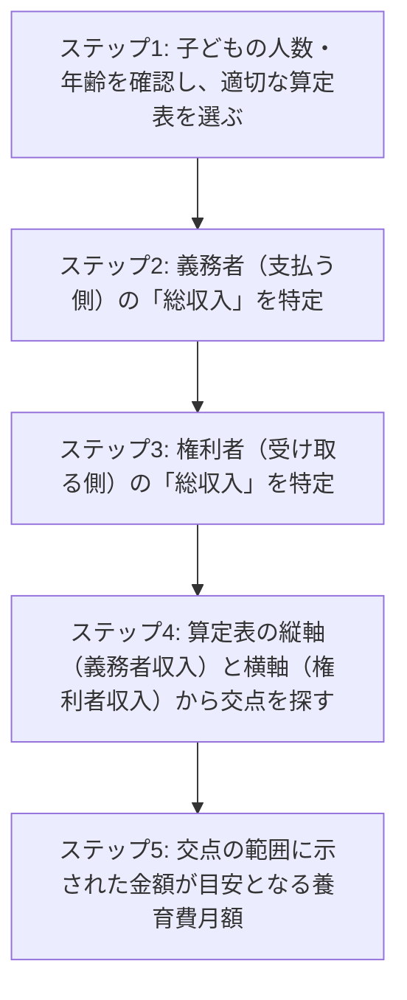
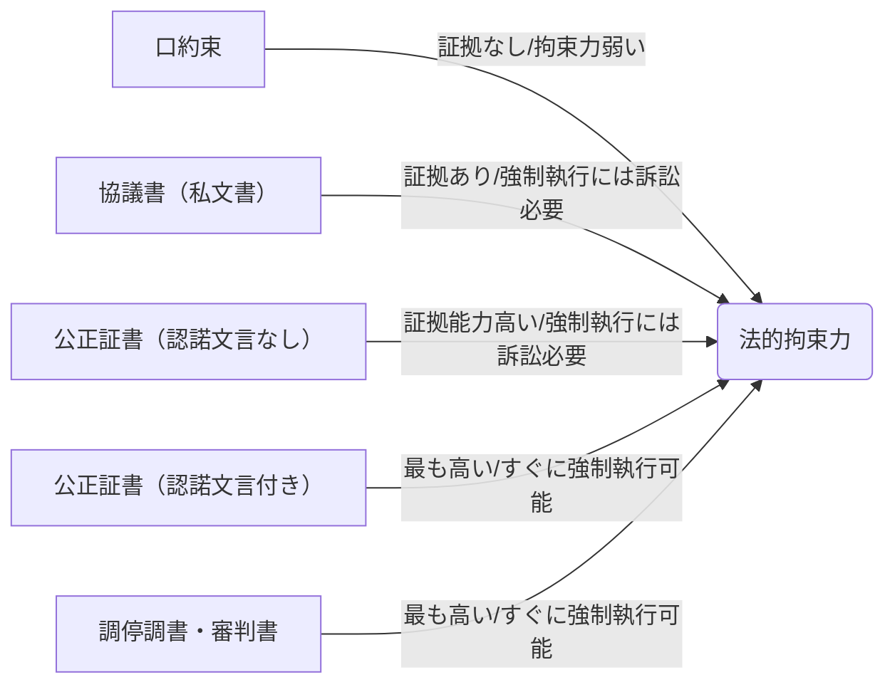

# 【2024年最新】養育費の計算方法を徹底解説！相場・シミュレーションから注意点まで

離婚を考える際、あるいはすでに離婚している場合でも、子どもの養育費は最も重要な問題の一つです。「一体いくらもらえるのか（支払うのか）？」「どのように計算するの？」といった疑問は尽きないでしょう。

養育費は、子どもの健やかな成長を支えるために欠かせない費用であり、適切な金額を取り決めることが、親双方そして何より子どもの未来を守る上で非常に大切です。

この記事では、日本の法律に詳しいSEOライターが、養育費の基本的な知識から、**裁判所が定める「養育費算定表」を使った具体的な計算方法、特別な事情がある場合の考え方、そして増額・減額請求のポイント**まで、わかりやすく徹底解説します。

読者の皆さんが適切な養育費の取り決めをできるよう、具体的な事例や注意点を交えながら、あなたの疑問を一つずつ解決していきますので、ぜひ最後までお読みください。

## 1. 養育費とは？基本的な理解を深めよう

まずは、養育費とは何か、その目的と法的根拠、そして誰がいつまで支払うのかといった基本的な事項について確認していきましょう。

### 1-1. 養育費の目的と法的根拠

養育費とは、**子どもが経済的、社会的に自立するまでに必要となる費用全般**を指します。これには、衣食住にかかる費用はもちろん、教育費（学費、習い事）、医療費、交通費、娯楽費などが含まれます。

親には「子どもを養育する義務」があり、これは法律上「扶養義務」として定められています（民法第877条）。離婚後も、親であることに変わりはないため、子どもを監護・養育しない親（非監護親）も、監護する親（監護親）と同等の生活レベルを子どもに保障する義務があります。この義務を経済的に果たすのが養育費なのです。

### 1-2. 誰が、いつまで支払うのか？

養育費を支払う義務があるのは、子どもと法律上の親子関係にある親です。これは、実の親子だけでなく、養子縁組をした親にも当てはまります。

では、いつまで支払うのでしょうか？ 以前は、子どもが「成人するまで」とされていましたが、2022年4月1日の民法改正により、成人年齢が20歳から18歳に引き下げられました。これに伴い、「養育費は18歳まで」と考える方が増えましたが、実際はそう単純ではありません。

多くの家庭裁判所の実務では、**子どもが大学や専門学校を卒業する22歳の3月まで**と定めるケースが一般的です。これは、18歳で成人しても、多くの学生が経済的に自立できていない現状を踏まえたものであり、親の扶養義務は「子どもが経済的に自立するまで」と広く解釈されているためです。

ただし、具体的な終期は、夫婦間の話し合いや調停・審判で決定されます。話し合いの段階で、子どもが高校卒業で就職する場合や、経済的な状況に応じて柔軟に設定することが可能です。

## 2. 養育費の計算方法の基本は「養育費算定表」

養育費の金額を算定する上で、最も重要なツールとなるのが、**裁判所が公表している「養育費算定表」**です。この算定表を理解することが、適切な養育費を計算する第一歩となります。

### 2-1. 養育費算定表とは？（裁判所の公式ツール）

養育費算定表は、裁判官や調停委員、弁護士などが養育費の目安額を算定する際に広く利用している一覧表です。
夫婦双方の収入（年収）と子どもの人数・年齢に応じて、標準的な養育費の金額が示されています。

この算定表は、最高裁判所司法研修所が作成したもので、過去の裁判例や経済状況などを総合的に考慮して作られており、**公平かつ迅速に養育費の目安額を把握できる**点が大きな特徴です。

### 2-2. 算定表を使うメリットとデメリット

**メリット:**
*   **客観的かつ公平な目安:** 感情的になりがちな養育費の話し合いにおいて、客観的な基準を提供します。
*   **計算が比較的容易:** 必要情報を当てはめるだけで、ある程度の金額を把握できます。
*   **調停・審判での利用:** 裁判所の手続きにおいて、この算定表が強く参考にされます。

**デメリット:**
*   **あくまで目安:** 個別の家庭の特殊な事情（高額な教育費、医療費など）は反映されにくい場合があります。
*   **収入の正確な把握が必要:** 自営業者や会社役員など、収入の計算が複雑な場合は注意が必要です。
*   **生活水準のずれ:** 高額所得者同士の場合、算定表の金額が実際の生活水準と乖離する可能性があります。

### 2-3. 算定表の見方（基本3要素: 支払い義務者の収入、権利者の収入、子どもの人数・年齢）

養育費算定表は、子どもの人数と年齢（0〜14歳、15歳以上）によって種類が分かれています。例えば、「子ども1人（0〜14歳）の養育費・婚姻費用算定表」といった具合です。

算定表を使って養育費の目安額を導き出すには、以下の3つの要素を把握する必要があります。

1.  **支払い義務者（養育費を支払う親）の年収**
2.  **権利者（養育費を受け取る親）の年収**
3.  **子どもの人数と年齢**

<!-- alt: 養育費算定表の基本的な見方フロー -->

**【年収の考え方】**
*   **給与所得者の場合:** 源泉徴収票の「支払金額」が基本となります。通勤手当など非課税の手当も含まれます。税込み年収で考えましょう。
*   **自営業者の場合:** 確定申告書の「課税される所得金額」ではなく、「所得金額」の欄に事業所得、不動産所得などを合算した金額から、実際に支出している経費を差し引いたものが目安となります。計算が複雑なため、弁護士などに相談することをおすすめします。

算定表は縦軸に義務者の年収、横軸に権利者の年収が記載されています。それぞれの年収に該当する箇所をたどり、交差するマスに書かれている金額が、月々の養育費の目安額となります。金額は「○○万円～○○万円」といった幅で示されていますが、これは年収の階層ごとの幅を示しています。

## 3. 養育費を計算してみよう！具体的な事例とシミュレーション

実際に養育費算定表を使って、具体的な事例で養育費をシミュレーションしてみましょう。ここでは、代表的な2つのケースを想定します。

（※以下に示す養育費の金額は、記事作成時点の最新の算定表（平成30年度司法研究「養育費算定に関する実証的研究」）に基づいています。実際の金額は個別の状況や算定表の改定によって変動する可能性があります。）

### 3-1. 事例1：夫婦共働きで子ども1人（8歳）のケース

*   **支払い義務者（元夫）:** 給与所得者、年収500万円
*   **権利者（元妻）:** 給与所得者、年収250万円
*   **子ども:** 1人（8歳）

この場合、「子ども1人（0～14歳）の養育費・婚姻費用算定表」を使用します。
1.  義務者（元夫）の縦軸「500万円」を探します。
2.  権利者（元妻）の横軸「250万円」を探します。
3.  両者の交点に示されているのは、月額**「4万円～6万円」**の範囲です。

この範囲内で、具体的な金額は双方の話し合いや、子どもの特別なニーズ（持病、高額な習い事など）によって調整されることになりますが、まずは月5万円程度が目安となります。

### 3-2. 事例2：片親が専業主婦で子ども2人（3歳・10歳）のケース

*   **支払い義務者（元夫）:** 給与所得者、年収700万円
*   **権利者（元妻）:** 無職（専業主婦）、年収0万円
*   **子ども:** 2人（3歳、10歳）

この場合、「子ども2人（第1子15歳以上、第2子14歳以下）の養育費・婚姻費用算定表」を使用します。（※子どもの年齢構成に合わせて適切な算定表を選びます。このケースでは、二人とも14歳以下なので「子ども2人（第1子、第2子いずれも14歳以下）の養育費・婚姻費用算定表」を用います。）
1.  義務者（元夫）の縦軸「700万円」を探します。
2.  権利者（元妻）の横軸「0万円」を探します。
3.  両者の交点に示されているのは、月額**「10万円～12万円」**の範囲です。

このケースでは、権利者が無職であるため、より高額な養育費が目安として算定されることになります。

### 3-3. 注意点：自営業者や会社役員の収入計算

前述の通り、給与所得者の収入は源泉徴収票で比較的容易に確認できますが、自営業者や会社役員の場合、収入の計算が複雑になります。

*   **自営業者:** 確定申告書の「所得金額」欄を参考にしますが、実際には税法上の控除と、養育費算定で考慮される実質的な支出が異なる場合があります。過度な経費計上や、個人的な費用を経費に含めている場合などは、実質的な所得を算出するために調整が必要となることがあります。
*   **会社役員:** 役員報酬だけでなく、会社からの借り上げ社宅や車両提供など、実質的な経済的利益も収入とみなされる場合があります。また、意図的に役員報酬を低く設定しているケースでは、会社の実態や過去の役員報酬額も考慮されることがあります。

これらのケースでは、算定表に単純に当てはめるだけでは実態を正確に反映できない可能性があるため、弁護士や税理士などの専門家のアドバイスを受けることを強くお勧めします。

## 4. 算定表だけでは決まらない？特別な事情がある場合の養育費

養育費算定表は非常に便利ですが、あくまで一般的なケースを想定したものです。以下のような特別な事情がある場合は、算定表の金額を増額・減額する方向に調整が必要になることがあります。

### 4-1. 医療費や教育費が高額な場合（私立学校、習い事など）

子どもが私立学校に通っていたり、特別な習い事（塾、留学、スポーツクラブなど）をしていて、その費用が高額である場合、算定表の金額だけでは足りないことがあります。特に離婚前からこれらの費用を負担していた経緯がある場合や、親双方の収入から見て妥当と判断される場合は、追加での負担を求めることが可能です。

ただし、これらの費用を算定表の金額に上乗せして請求する場合、その必要性や金額の妥当性を具体的に主張し、裏付けとなる資料（請求書、領収書など）を提示することが重要になります。

### 4-2. 親の再婚や再婚相手の収入

親が再婚した場合、再婚相手も「家庭」を構成する一員となりますが、再婚相手には直接の子どもの扶養義務はありません。しかし、再婚によって子どもの監護親や支払い義務者の家計に余裕が生まれたと判断される場合には、間接的に養育費の金額に影響を与える可能性があります。

例えば、監護親が再婚し、再婚相手の収入が非常に高い場合、監護親の経済的負担が軽減されたとみなされ、支払い義務者が減額を主張する材料となる可能性もあります。逆に、支払い義務者が再婚し、新たに子どもが生まれた場合は、その新しい子どもにも扶養義務が生じるため、元々の子どもへの養育費が減額されるケースもあります。

### 4-3. 子どもの病気や障がい

子どもに持病があったり、障がいがあるために、継続的に高額な医療費や特別支援教育費が必要となる場合は、算定表の金額では賄いきれないことがほとんどです。このようなケースでは、特別な費用について養育費とは別に、または養育費に上乗せして負担を求めることができます。

この場合も、診断書や医療費の明細、特別支援教育の費用に関する資料など、具体的な根拠を提示することが不可欠です。

### 4-4. 住宅ローンや高額な借金がある場合

支払い義務者が離婚後に住宅ローンを単独で負担している場合、特にその住宅に監護親と子どもが住み続けているようなケースでは、養育費の金額調整の要素となることがあります。また、高額な借金がある場合でも、それが子どもの養育とは無関係の借金であれば、原則として養育費を減額する理由にはなりません。しかし、借金の返済によって生活が著しく困窮し、養育費の支払いが困難になる場合には、減額を検討する余地が生まれることもあります。

これらの事情は、裁判所でも慎重に判断されるため、専門家と相談しながら適切な主張を行うことが重要です。

### 4-5. 面会交流の頻度と養育費の関係

面会交流の頻度自体は、原則として養育費の金額に直接影響を与えるものではありません。養育費は子どもの養育にかかる費用であり、面会交流は親子の交流の機会だからです。

しかし、例えば子どもが非監護親の元に宿泊を伴う面会交流を非常に頻繁に行い、実質的に非監護親が子どもの衣食住にかかる費用を大幅に負担しているようなケースでは、養育費の減額要因として考慮されることもあります。これは、子どもの監護にかかる実質的な費用負担が、両親間で大きく変化していると判断されるためです。

## 5. 養育費の増額・減額請求について

一度決めた養育費の金額も、離婚後の状況変化によっては増額や減額を請求できる場合があります。

### 5-1. 増額請求が認められるケース

以下のような状況変化があった場合、養育費の増額請求が認められる可能性があります。
*   **支払い義務者（元配偶者）の収入が大幅に増加した:** 昇進や転職により年収が大幅にアップした場合など。
*   **監護親（養育費を受け取る側）の収入が大幅に減少した:** 失業、病気による休職、減給など。
*   **子どもの養育費が著しく増加した:**
    *   子どもが私立学校に進学した、大学や専門学校に進学した。
    *   子どもに予期せぬ病気や障がいが見つかり、高額な医療費や介護費用が必要になった。
    *   子どもの年齢が上がり、生活費や教育費が自然に増加した。
*   **物価の変動など、社会経済状況の大きな変化**

### 5-2. 減額請求が認められるケース

反対に、以下のような状況変化があった場合、養育費の減額請求が認められる可能性があります。
*   **支払い義務者（元配偶者）の収入が大幅に減少した:** リストラ、病気による休職、減給、自己破産など。
*   **監護親（養育費を受け取る側）の収入が大幅に増加した:** 転職や昇進、資格取得による大幅な収入アップなど。
*   **支払い義務者（元配偶者）が再婚し、新たに子どもが生まれた:** 新たな扶養家族が増えたことにより、負担能力が低下したと判断される場合。
*   **監護親が再婚し、再婚相手と子どもが養子縁組をした:** 再婚相手に一次的な扶養義務が生じるため、実親の養育費が減額される可能性があります。
*   **子どもが就職や結婚などで経済的に自立した。**

### 5-3. 増額・減額請求の手続き方法（話し合い、調停、審判）

増額・減額を請求する際の手続きは、以下の順に進めるのが一般的です。

1.  **話し合い（協議）:** まずは、当事者間で現在の状況と養育費の見直しについて話し合いを行います。相手に現在の収入状況や子どもの変化について、具体的な資料を提示して理解を求めることが重要です。
2.  **養育費請求調停:** 話し合いで合意に至らない場合、家庭裁判所に「養育費請求調停」を申し立てます。調停では、調停委員を介して双方の意見や資料を出し合い、合意形成を目指します。算定表もここで参考にされます。
3.  **審判:** 調停でも合意に至らない場合、調停は不成立となり、自動的に「審判」の手続きに移行します（または改めて審判を申し立てます）。審判では、裁判官が双方の主張や証拠に基づいて、一切の事情を考慮し、最終的な養育費の金額を決定します。

この手続きは、当事者間の合意形成を促すために段階的に設けられています。

## 6. 養育費に関する取り決め方と注意点

養育費の金額が決まったら、その取り決め方を明確にすることが重要です。特に、口約束は非常に危険です。

### 6-1. 口約束は危険！なぜ公正証書が必要なのか？

「口約束」は、最も手軽な取り決め方法ですが、**後々トラブルになりやすく、法的な強制力がありません。** 相手が「そんな約束はしていない」「金額が違う」と言い出した場合、証拠がないため、言った言わないの水掛け論になりがちです。

養育費は長期間にわたって支払われるものですから、将来の紛争を防ぐためにも、必ず書面で残すべきです。そして、その書面の中でも、**「公正証書」**を作成することを強くお勧めします。

### 6-2. 強制執行認諾文言付公正証書とは？

公正証書は、公証役場で公証人が作成する公文書です。当事者の合意内容を正確に記録し、法律の専門家である公証人が関与するため、その証拠能力は非常に高いです。

特に、養育費に関する取り決めでは、**「強制執行認諾文言付公正証書」**を作成することが非常に重要です。この文言が入っていれば、万が一相手が養育費の支払いを滞納した場合、改めて裁判を起こすことなく、**相手の給与や財産を差し押さえる「強制執行」の手続き**に進むことができます。

強制執行認諾文言がない公正証書や、弁護士が作成した合意書（私文書）の場合、強制執行を行うためには、改めて裁判所に「履行勧告」「履行命令」「強制執行」の申し立てをしたり、さらには訴訟を起こして判決を得たりといった手間と時間がかかります。

養育費は子どもの生活に直結する費用ですから、確実に支払いを確保するためにも、公正証書、特に強制執行認諾文言付きの公正証書の作成を強く検討すべきです。

### 6-3. 離婚調停・審判での取り決め

夫婦間の話し合いや公正証書の作成が難しい場合は、家庭裁判所の**離婚調停**を利用して養育費を取り決めることになります。調停で合意に至れば、その内容は「調停調書」として記録されます。

調停調書も公正証書と同様に強い法的効力を持ち、相手が支払いを怠った場合には、これを根拠に強制執行を行うことが可能です。

調停でも合意に至らない場合は、**審判**に移行し、裁判官が判断を下します。審判で出された決定（審判書）も、法的な強制力を持ちます。

<!-- alt: 養育費取り決め方法の法的拘束力比較図 -->

## 7. 養育費に関するよくある疑問Q&A

### Q1: 養育費の支払いが滞ったらどうすればいい？

まず、相手に連絡を取り、状況を確認しましょう。経済的な事情があれば、一時的な減額や支払い猶予を検討することも必要かもしれません。話し合いで解決しない場合は、上記で説明した通り、公正証書や調停調書・審判書を根拠に、家庭裁判所に**履行勧告・履行命令**を申し立てたり、最終的には**強制執行**（給与や預貯金の差し押さえ）を申し立てることができます。

### Q2: 養育費はいつまで支払われるもの？（成人年齢引き下げの影響）

2022年4月1日の民法改正により成人年齢は18歳になりましたが、多くのケースでは**「子どもが大学・専門学校を卒業する22歳の3月まで」**と取り決めるのが一般的です。これは、子どもが18歳で経済的に自立することは稀であるという実情を考慮したものです。取り決めの際には、具体的な終期を明確に合意しておくことが重要です。

### Q3: 養育費に税金はかかる？

養育費は、受け取った側も支払った側も、**原則として非課税**です。子どもの養育に必要な費用とみなされるため、贈与税や所得税の課税対象にはなりません。ただし、養育費の名目で過大な金額を受け取ったり、子どもの養育目的以外に使用していると判断された場合は、贈与税の対象となる可能性もあります。

### Q4: 養育費と面会交流はセット？

養育費と面会交流は、法律上は別々の権利義務として扱われます。養育費の支払いがないからといって面会交流を拒否することはできませんし、逆に面会交流ができないからといって養育費の支払いを拒むこともできません。
ただし、前述の通り、面会交流の頻度が非常に高く、実質的な監護負担が大きく変わるような場合は、養育費の金額調整の要素となることはあります。

## まとめ：適切な養育費で子どもの未来を守ろう

養育費は、離婚後も変わらない「親としての子どもに対する扶養義務」を果たすための大切な費用です。その計算方法は複雑に感じるかもしれませんが、裁判所の養育費算定表を理解し、具体的な事情に合わせて調整することで、適切な金額を導き出すことができます。

### 本記事のポイントをまとめます。

*   **養育費の目的と期間:** 子どもの自立までの費用。多くのケースで22歳3月までが目安。
*   **計算の基本は「養育費算定表」:** 夫婦双方の年収と子どもの人数・年齢で目安額を算出。
*   **特別な事情も考慮:** 高額な教育費や医療費、親の再婚などは増減の要素に。
*   **状況変化で増減請求が可能:** 収入の大幅な変化や子どもの進学などが主な理由。
*   **書面での取り決めが必須:** 口約束は危険！**公正証書（特に強制執行認諾文言付き）や調停調書**で法的拘束力を持たせることが重要。

養育費は、一度決まると長期にわたる支払いとなるため、取り決める際には慎重に進める必要があります。もし、ご自身のケースで不安な点がある、相手との話し合いがうまくいかない、あるいは複雑な事情があるという場合は、一人で抱え込まずに弁護士などの専門家に相談することをお勧めします。

専門家のアドバイスを受けることで、あなたの状況に合わせた最適な養育費の取り決めができ、子どもの健やかな未来を守る一助となるでしょう。